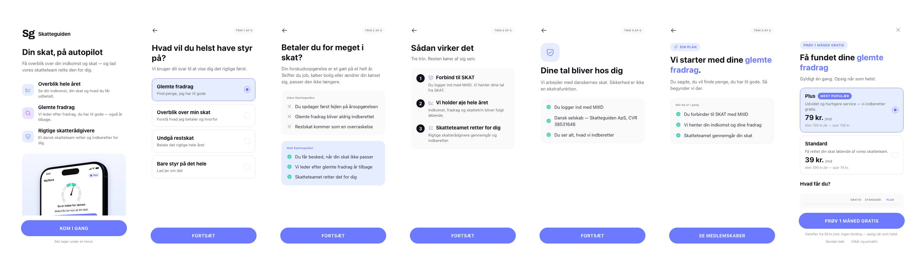
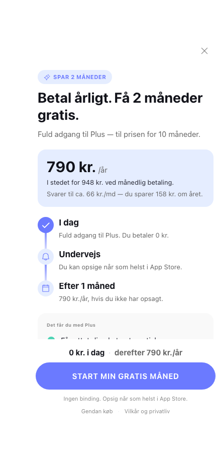

# Skatteguiden — onboarding & paywalls (Adapty Flow)

Two Adapty flows for [skatteguiden.dk](https://www.skatteguiden.dk), plus a clickable
prototype. Danish (`da`), single locale.



## The flows

Both live in the Adapty **Demo app** (`fe2b48a4-8b86-4f80-b984-bdb94f680789`) and are
**drafts — not published**.

| Flow | ID | Screens |
| :--- | :--- | :--- |
| Skatteguiden — Onboarding + Medlemskab | `c703bd83-3c43-4f08-85e4-ec1c6755b729` | 7 |
| Skatteguiden — Årligt medlemskab (spar 2 måneder) | `6f5f6aa4-9280-4f8a-bd13-a72114629252` | 1 |

### Onboarding + Medlemskab

`problem → method → proof`, not the usual goal-quiz → loader → "your plan is ready". A loader
would promise a calculation the flow cannot do — the real personalisation happens after MitID,
outside the flow. So screen 2 captures a goal and screens 6 and 7 **echo it back** rather than
inventing a projection.

1. **Velkommen** — value rows + hero
2. **Dit mål** — goal capture (`fradrag` / `overblik` / `restskat` / `alt`)
3. **Problemet** — forskudsopgørelse pain, uden/med split
4. **Sådan virker det** — MitID → monitoring → skatteteam
5. **Sikkerhed** — MitID, CVR 38531646
6. **Din plan** — headline branches on the goal
7. **Medlemskab** — Plus/Standard cards over a Gratis/Standard/Plus comparison

The branch is a `switch` on `goal.selectedOptionId`, read on screens 6 and 7.

### Årligt medlemskab

Single-plan, trial timeline. The offer is the annual saving, and the arithmetic is exact:
**790 = 10 × 79**, so a year costs ten months. 948 − 790 = **158 kr.**, ≈ 66 kr./md.

Every figure comes from
[konto.skatteguiden.dk/bliv-medlem/pakker](https://konto.skatteguiden.dk/bliv-medlem/pakker).
No invented reference price, and no `old-price` element — that one renders in preview and is
absent on device.



## Prototype

`prototype/skatteguiden-prototype.html` — self-contained, no build step, no network beyond the
Google Fonts link. Open it and click through. Pick a different goal on Trin 1 and the headlines
on Trin 5 and the paywall rewrite themselves; that is the `switch` branching, which a static
render cannot show.

It renders in **Poppins**, so it also previews what the flows look like once the font is
uploaded to the Flow Builder (see *Known gaps*).

## Layout

```
flows/       the two configs, exactly as saved in Adapty
src/         the generators that produce them
prototype/   template + generator + the built page
assets/      logo, hero, Phosphor icon set
docs/        renders
```

## Rebuilding

Needs `flowkit.py` from the `adapty-skills` `flow-generator` plugin; `src/` resolves it from
`~/.claude/plugins/cache/adapty/adapty-skills/*/skills/flow-generator/references`.

```bash
python3 src/build_onboarding.py
python3 src/build_annual_offer.py
python3 prototype/build_prototype.py
```

Element ids come from a seeded counter, so a rebuild is **byte-identical** to what is committed
here — a non-empty `git diff` after running these means something actually changed.

Push a config to Adapty with the optimistic lock:

```bash
APP=fe2b48a4-8b86-4f80-b984-bdb94f680789
FLOW=c703bd83-3c43-4f08-85e4-ec1c6755b729
UA=$(adapty flows config get $FLOW --app $APP --json | jq -r .updated_at)
adapty flows config update $FLOW --app $APP \
  --config-file flows/skatteguiden-onboarding.json --expected-updated-at "$UA"
```

## Theme

Sampled from the live site's computed styles and the app screenshots — nothing picked by eye.

| Token | Hex | |
| :--- | :--- | :--- |
| `primary` | `#6B7AFF` | CTA blue |
| `ink` | `#12131A` | headings; also the logo's own ink |
| `ink2` | `#292A35` | body strong |
| `muted` / `faint` | `#666666` / `#888888` | |
| `tint` / `tintPlus` | `#E5EDFF` / `#EAE0FF` | |
| `mint` | `#4ED3B4` | checks, gauge |
| `purple` | `#9563FF` | |
| `border` | `#E4E4E9` | |
| `surface` | `#F9F9F9` | |
| `green` | `#2C622C` | comparison ticks |

`dark` is set equal to `light` on every token — the app is light-only, so a dark palette would
have been invented rather than sampled.

## Known gaps

- **Poppins is not in the flows.** Custom fonts are Flow Builder–only; a config cannot reference
  one. The presets carry size, weight and leading, so uploading the font in the builder is the
  only step left. The prototype already uses it.
- **The bound products are demo products.** The catalog has no Skatteguiden products, so the
  onboarding paywall binds two *monthly* products and the annual offer binds an *annual* one —
  periods match what each screen claims, but the prices on screen are static text from the
  pricing page, not store-resolved. Swap in real products, or switch the labels to price
  variables.
- **Neither bound product carries an intro offer.** Both screens promise a free month.
  Configure the real trial before either ships.
- **No social proof anywhere.** No rating, review count or outcome stat — none were available,
  and inventing them was not an option. This is the highest-value thing still missing from
  screen 1 and the paywall.
- **The annual saving is real but not exclusive.** It is the public annual price, so the screen
  does not claim first-time-only. A genuinely exclusive intro offer needs a price that does not
  exist yet plus a store product configured for it.

## Notes

`assets/phosphor-icons.json` is [Phosphor Icons](https://phosphoricons.com) (MIT), inlined
because the Adapty media endpoint rejects SVG uploads and `_meta.icons` takes raw markup.

Logo and hero are Skatteguiden's own: the hero frames their app dashboard screenshot on a
brand-tint panel.
